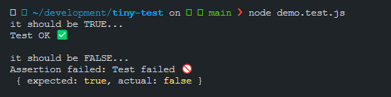

# Tiny test 🐞

> Simple testing library based on [console.assert](https://developer.mozilla.org/en-US/docs/Web/API/console/assert)

After finding out about the console.assert method, I got curious and started to implement my basic testing library for fun.

